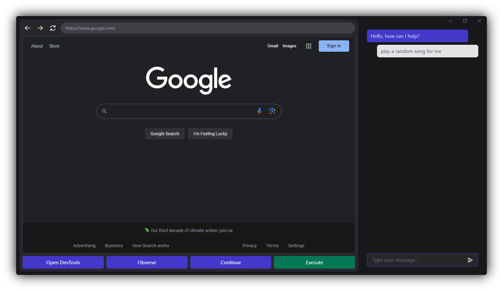

# GPT-4V-Act: Chromium Copilot

> ⚠️ **Important Note:** As GPT-4V(ision) has not yet been made publicly available, this project necessitates an active ChatGPT Plus subscription for multimodal prompting access. It's worth noting that the tactics used by this project to tap into an unofficial GPT-4V API may contravene the associated ChatGPT Term of Service clause:
>> **2.** (c) **Restrictions:**  You may not ... (iv) except as permitted through the API, use any automated or programmatic method to extract data or output from the Services, including scraping, web harvesting, or web data extraction;

GPT-4V-Act serves as an eloquent multimodal AI assistant that harmoniously combines GPT-4V(ision) with a web browser. It's designed to mirror the input and output of a human operator—primarily screen feedback and low-level mouse/keyboard interaction. The objective is to foster a smooth transition between human-computer operations, facilitating the creation of tools that considerably boost the accessibility of any user interface (UI), aid workflow automation, and enable automated UI testing.


https://github.com/ddupont808/GPT-4V-Act/assets/3820588/fbcde8d1-a7d6-4089-95f6-fd099cc98a0d


## How it works

GPT-4V-Act leverages both [GPT-4V(ision)](https://openai.com/research/gpt-4v-system-card) and [Set-of-Mark Prompting](https://arxiv.org/abs/2310.11441), together with a tailored auto-labeler. This auto-labeler assigns a unique numerical ID to each interactable UI element.

By incorporating a task and a screenshot as input, GPT-4V-Act can deduce the subsequent action required to accomplish a task. For mouse/keyboard output, it can refer to the numerical labels for exact pixel coordinates.


**Get Started!**
```bash
# Clone the repo
git clone https://github.com/ddupont808/GPT-4V-Act ai-browser
# Navigate to the repo directory
cd ai-browser
# Install the required packages
npm install
# Start the demo
npm start
```

## Demonstration Prompt

Below is an example of using the user-interface to instruct the agent to "play a random song for me"



This is the prompt seen by GPT-4V and the corresponding output

### User

```markdown
task: play a random song for me

type ClickAction = { action: "click", element: number }
type TypeAction = { action: "type", element: number, text: string }
type ScrollAction = { action: "scroll", direction: "up" | "down" }
type RequestInfoFromUser = { action: "request-info", prompt: string }
type RememberInfoFromSite = { action: "remember-info", info: string }
type Done = { action: "done" }

## response format
{
  briefExplanation: string,
  nextAction: ClickAction | TypeAction | ScrollAction | RequestInfoFromUser | RememberInfoFromSite | Done
}

## instructions
# observe the screenshot, and think about the next action
# output your response in a json markdown code block
```

### Assistant
```json
{
  "briefExplanation": "I'll type 'random song' into the search bar to find a song for you.",
  "nextAction": { "action": "type", "element": 7, "text": "random song" }
}
```
